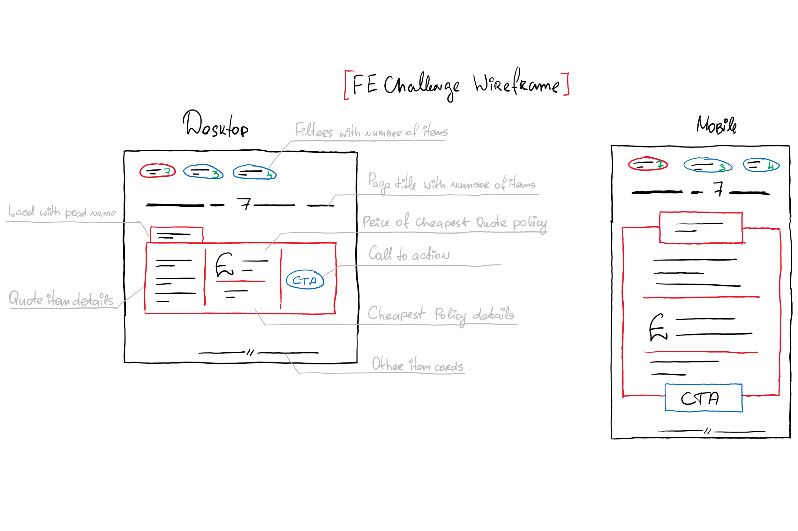

## [FE Coding Challenge]

This front-end challenge is designed for you to showcase your abilities, and demonstrate what you would consider to be production ready code.  

### Before you start

- There are no time constraints. `(Submission date should be confirmed with your main point of contact)`   
- There are no restrictions on the tech stack.  
- The wireframe design, provided below is just for guidance. You are free to use it, or to introduce a suitable alternative instead.
- You should have been provided with a link to an empty repository on github, and should have permission to clone, and push changes to it. 

### Requirements

- Must be responsive, supporting both desktop & mobile.  
- For non senior candidates, please consume [this API endpoint](https://gc-frontendchallenge-2019.azurewebsites.net/api/easymode) for data.  For senior level candidates please consume [this API endpoint](https://gc-frontendchallenge-2019.azurewebsites.net/api/hardmode) instead.
- Must be able to filter by product (e.g. "Car", "Pet", "All").  
- Must include a counter, reflecting total quotes visible for the current view.  
- Each quote should be displayed as a 'card'.  
- Must align with _your_ definition of production ready code.  
- App must work, and look as expected in all major browsers on both desktop & mobile.  

### Task

Build a simple app which consumes, handles and displays data served from an API, with a UI reflecting either the provided wireframe, or a suitable alternative.  

Please include any additional material, if you feel it may:
- Assist our understanding of your submission
- Support any technical considerations that you've made
- Support any technical decisions that you've made

It is expected that we can build your solution. If you think it will assist, please provide the appropriate build instructions.  

### Submission

When complete, please push your code to the github repository that was provided to you alongside this challenge.  

Once the PR has been submitted, please email luke.stegall@futurenet.com and Andrew.Challen@futurenet.com to inform them that you have opened the pull request, and we will review at the earliest opportunity.

### Wireframe

